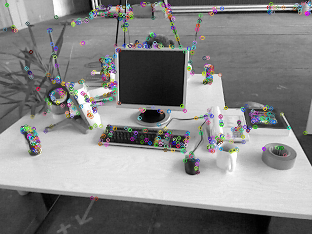
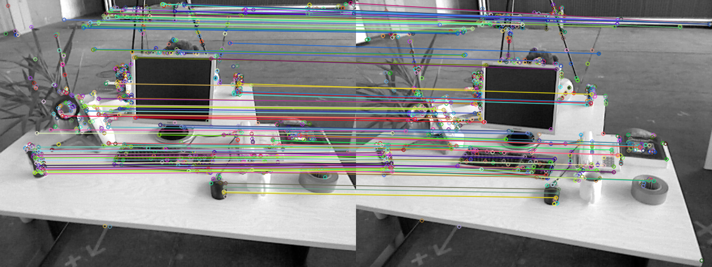
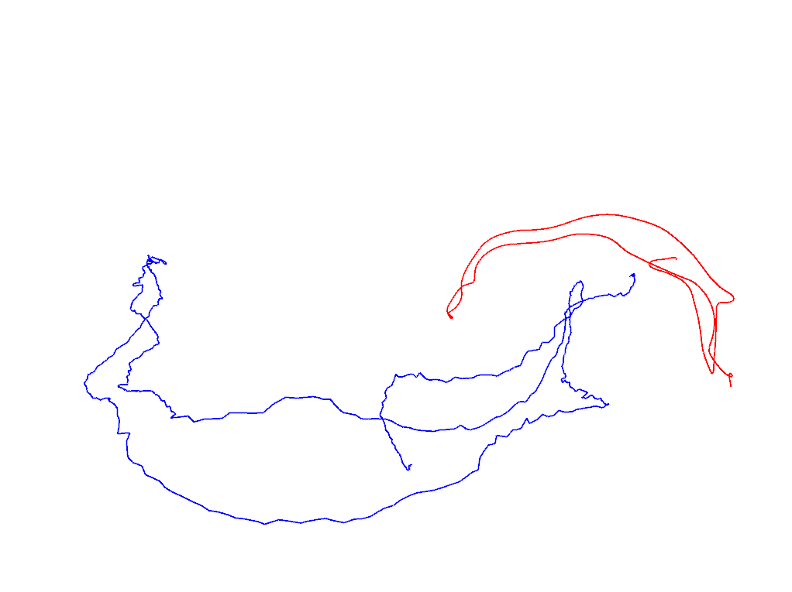
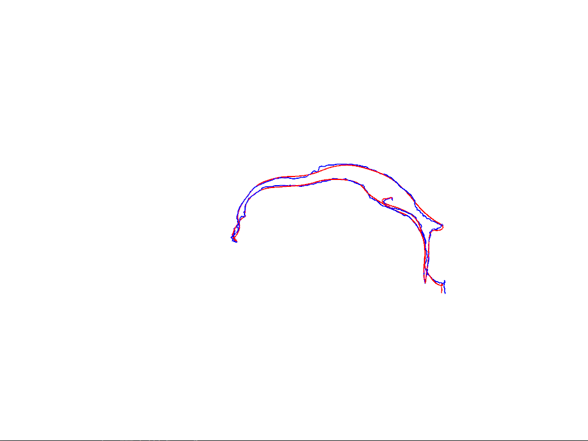

# Visual Odometry Using Feature Points

---

## ORB Feature Extraction and Matching

### 1. Implement oriented FAST upon OpenCV FAST keypoint detection

The detected oriented FAST keypoints are shown in the picture below.



Detection result stats for both images are shown in the follwing table:

|  Type | Total | Bad |
|:-----:|:-----:|:---:|
| 1.png |  638  |  9  |
| 2.png |  595  |  1  |

The source code for oriented FAST keypoint detection is as follows.

```c++
/**
 * compute the orientation for ORB descriptor
 * 
 * @param [in] image input image
 * @param [in|out] detected keypoints
 */
void computeAngle(const cv::Mat &image, vector<cv::KeyPoint> &keypoints) {
    // half patch size:
    const int HALF_PATCH_SIZE = 8;
    // image size:
    const int M = image.rows; const int N = image.cols;

    for (auto &kp : keypoints) {
        // patch center:
        const int x0 = (int)kp.pt.x;
        const int y0 = (int)kp.pt.y;

        // keypoint angle:
        double angle = 0.0;

        // only central region:
        if (
            (HALF_PATCH_SIZE <= x0 && HALF_PATCH_SIZE <= y0) &&
            (N - HALF_PATCH_SIZE >= x0 && M - HALF_PATCH_SIZE >= y0)
        ) {
            // init moments:
            double moment[2][2] = {
                {0.0, 0.0},
                {0.0, 0.0}
            };

            for (int u = -HALF_PATCH_SIZE; u < HALF_PATCH_SIZE; ++u) {
                for (int v = -HALF_PATCH_SIZE; v < HALF_PATCH_SIZE; ++v) {
                    const uchar I = image.at<uchar>(y0 + v, x0 + u);

                    moment[0][0] += I;
                    moment[1][0] += u * I;
                    moment[0][1] += v * I;
                }
            }

            // centroid:
            double xc = moment[1][0] / moment[0][0];
            double yc = moment[0][1] / moment[0][0];

            // direction angle in degree:
            angle = 180.0 * atan2(yc, xc) / pi; 
        }

        kp.angle = angle; 
    }
    return;
}
```

### 2. Implement BRIEF feature description for detected oriented FAST keypoint

The source code for BRIEF feature description is as follows:

```c++
/**
 * compute ORB descriptor
 * @param [in] image the input image
 * @param [in] keypoints detected keypoints
 * @param [out] desc descriptor
 */
void computeORBDesc(const cv::Mat &image, vector<cv::KeyPoint> &keypoints, vector<DescType> &desc) {
    // image size:
    const int M = image.rows; const int N = image.cols;
    // half patch size:
    const int HALF_PATCH_SIZE = 8;

    // bad description stats:
    int bad = 0;
    
    for (auto &kp: keypoints) {
        // init description:
        DescType d(ORB_SAMPLE_DIM, false);

        // keypoint position:
        const int x0 = (int)kp.pt.x;
        const int y0 = (int)kp.pt.y;       

        // only central region:
        if (
            (HALF_PATCH_SIZE <= x0 && HALF_PATCH_SIZE <= y0) &&
            (N - HALF_PATCH_SIZE >= x0 && M - HALF_PATCH_SIZE >= y0)
        ) {
            for (int i = 0; i < ORB_SAMPLE_DIM; i++) {
                // parse the locations of sample pair:
                int up_original = ORB_SAMPLE_PATTERN[i*4 + 0];
                int vp_original = ORB_SAMPLE_PATTERN[i*4 + 1];
                int uq_original = ORB_SAMPLE_PATTERN[i*4 + 2];
                int vq_original = ORB_SAMPLE_PATTERN[i*4 + 3];
                
                // rotate to principal direction:
                double theta = pi * kp.angle / 180.0;
                int up_principal = (int)(cos(theta)*up_original - sin(theta)*vp_original);
                int vp_principal = (int)(sin(theta)*up_original + cos(theta)*vp_original);
                int uq_principal = (int)(cos(theta)*uq_original - sin(theta)*vq_original);
                int vq_principal = (int)(sin(theta)*uq_original + cos(theta)*vq_original);

                // identify intensities of sample pair:
                uchar pi = image.at<uchar>(y0 + vp_principal, x0 + up_principal);
                uchar qi = image.at<uchar>(y0 + vq_principal, x0 + uq_principal);

                // generate description bit:
                d[i] = qi > pi;  
            }
        } else {
            // if key point goes outside, set d.clear()
            d.clear();
            bad++;
        }        

        desc.push_back(d);
    }

    // bad description stats:
    cout << "bad/total: " << bad << "/" << desc.size() << endl;

    return;
}
```

### 3. Implement brute force matching for ORB features

The feature matching using brute force search is shown in the image below.



118 matches are found under given threshold *d_max = 50*.

The source code for brute force matching of ORB features is as follows:

```c++
/**
 * hamming distance for binary feature
 * @param d1 the first feature description
 * @param d2 the second feature description
 * @return hamming distance of the two binary features
 */
int hamming_distance(const DescType &d1, const DescType &d2) {
    if (d1.size() == d2.size()) {
        int distance = 0;

        for (int i = 0; i < ORB_SAMPLE_DIM; ++i) {
            distance += (d1[i] != d2[i] ? 1 : 0);
        }   

        return distance;
    }

    return ORB_SAMPLE_DIM;
}

/**
 * brute-force match two sets of descriptors
 * @param desc1 the first descriptor
 * @param desc2 the second descriptor
 * @param matches matches of two images
 */
void bfMatch(const vector<DescType> &desc1, const vector<DescType> &desc2, vector<cv::DMatch> &matches) {
    const int D_MAX = 50;

    for (int i = 0; i < desc1.size(); ++i) {
        // init match index:
        cv::DMatch m;
        m.queryIdx = i;
        m.distance = ORB_SAMPLE_DIM;

        // find optimal match:
        for (int j = 0; j < desc2.size(); ++j) {
            int d = hamming_distance(desc1[i], desc2[j]);
            if (d < m.distance) {
                m.distance = d;
                m.trainIdx = j;
            }
        }

        if (m.distance <= D_MAX) {
            matches.push_back(m);
        }
    }

    for (auto &m: matches) {
        cout << m.queryIdx << ", " << m.trainIdx << ", " << m.distance << endl;
    }

    return;
}
```

### 4. Answer the following questions

#### 1. Why is ORB called binary feature?

Because ORB description consists of only 0s and 1s rather than real numbers.

#### 2. Why 50 is chosen as the threshold? How will its change affect the matching process?

This value is chosen according to engineering experience. Its value on matching result is summarized as follows:

|  Change  |               Effect               |
|:--------:|:----------------------------------:|
| decrease | total number of matching decreases |
| increase | total number of matching increases |

#### 3. How does brute force matching performs on your machine? How can you improve the matching process?

It takes a long time to evaluate the 373,626 feature point pairs required by brute force matching.

Algorithms like locality sensitive hashing (LSH) and fast library for approximated nearest neighbor (FLANN) can be used to accelerate the matching process.

---

## Pose Estimation from Essential Matrix:

The four possible poses are shown below:

```shell
# pose 1:
R1 =
 -0.998596  0.0516992 -0.0115267
-0.0513961   -0.99836 -0.0252005
 0.0128107  0.0245727  -0.999616
t1 =
 -0.581301
-0.0231206
  0.401938
# pose 2:
R2 =
  -0.365887  -0.0584576    0.928822
-0.00287462    0.998092   0.0616848
   0.930655  -0.0198996    0.365356
t2 =
 0.581301
0.0231206
-0.401938
# pose 3:
R3 =
 -0.998596  0.0516992 -0.0115267
-0.0513961   -0.99836 -0.0252005
 0.0128107  0.0245727  -0.999616
t3 =
 0.581301
0.0231206
-0.401938
# pose 4:
R4 =
  -0.365887  -0.0584576    0.928822
-0.00287462    0.998092   0.0616848
   0.930655  -0.0198996    0.365356
t4 =
 -0.581301
-0.0231206
  0.401938
``` 

The souce code for pose estimation through SVD is as follows:
```c++
#include <iostream>

#include <Eigen/Core>
#include <Eigen/Dense>
#include <Eigen/Geometry>

#include <sophus/so3.h>

using namespace Eigen;
using namespace std;

int main(int argc, char **argv) {
    // essential matrix definition:
    Matrix3d E;
    E << -0.020361855052347700, -0.40071100381184450, -0.03324074249824097,
         +0.393927077821636900, -0.03506401846698079, +0.58571103037210150,
         -0.006788487241438284, -0.58154342729156860, -0.01438258684486258;

    // camera pose:
    Matrix3d R;
    Vector3d t;

    // SVD decomposition:
    JacobiSVD<Matrix3d> svd(E, ComputeFullV | ComputeFullU);

    // sigma matrix:
    double scale = (svd.singularValues()[0] + svd.singularValues()[1]) / 2.0;
    DiagonalMatrix<double, 3> sigma(scale, scale, 0.0);

    // rotation matrix:
    Matrix3d Rz_pos = AngleAxisd(+M_PI/2.0, Vector3d(0, 0, 1)).toRotationMatrix(); 
    Matrix3d Rz_neg = AngleAxisd(-M_PI/2.0, Vector3d(0, 0, 1)).toRotationMatrix();

    // pose estimation:
    Matrix3d t_wedge1 = svd.matrixU() * Rz_pos * sigma * svd.matrixU().transpose();
    Matrix3d t_wedge2 = svd.matrixU() * Rz_neg * sigma * svd.matrixU().transpose();

    Matrix3d R1 = svd.matrixU() * Rz_pos * svd.matrixV().transpose();
    Matrix3d R2 = svd.matrixU() * Rz_neg * svd.matrixV().transpose();

    // pose 1:
    cout << "R1 = \n" << R1 << endl;
    cout << "t1 = \n" << +1.0 * Sophus::SO3::vee(t_wedge1) << endl;
    cout << endl;
    // pose 2:
    cout << "R2 = \n" << R2 << endl;
    cout << "t2 = \n" << +1.0 * Sophus::SO3::vee(t_wedge2) << endl;
    cout << endl;
    // pose 3:
    cout << "R3 = \n" << R1 << endl;
    cout << "t3 = \n" << -1.0 * Sophus::SO3::vee(t_wedge1) << endl;
    cout << endl;
    // pose 2:
    cout << "R4 = \n" << R2 << endl;
    cout << "t4 = \n" << -1.0 * Sophus::SO3::vee(t_wedge2) << endl;
    cout << endl;

    // check t^R=E up to scale
    Matrix3d tR = t_wedge1 * R1;
    cout << "t^R = \n" << tR << endl;

    return 0;
}
```

The corresponding CMake file is attached below:
```cmake
CMAKE_MINIMUM_REQUIRED(VERSION 3.5)

PROJECT(OBSERVATION_MODEL)

# OpenCV3:
FIND_PACKAGE(OpenCV 3.0 QUIET)
IF(NOT OpenCV_FOUND)
   FIND_PACKAGE(OpenCV 2.4.3 QUIET)
   IF(NOT OpenCV_FOUND)
      MESSAGE(FATAL_ERROR "OpenCV > 2.4.3 not found.")
   ENDIF()
ENDIF()
# Eigen3:
FIND_PACKAGE(Eigen3 REQUIRED)
# Sophus:
SET(SOPHUS_INCLUDE_DIR "/home/alexge/svslocal/include")

# header files:
INCLUDE_DIRECTORIES(
    ${EIGEN3_INCLUDE_DIR}
    ${SOPHUS_INCLUDE_DIR}
)
# shared libraries:
LINK_DIRECTORIES(/home/alexge/svslocal/lib)

# runnable:
ADD_COMPILE_OPTIONS(-std=c++11)

# 02. Pose Estimation from Essential Matrix:
SET(CMAKE_RUNTIME_OUTPUT_DIRECTORY ${PROJECT_SOURCE_DIR}/02-camera-pose-estimation)
ADD_EXECUTABLE(pose-estimation 02-camera-pose-estimation/pose-estimation.cpp)
TARGET_LINK_LIBRARIES(
    pose-estimation
    ${EIGEN3_LIBS}
    Sophus
)
```

---

## PnP using Bundle Adjustment through Gaussian-Newton Method

The result of pose estimation is as follows:

```shell
   0.997866186837  -0.0516724392948   0.0399128072707   -0.127226620999
  0.0505959188721    0.998339770315   0.0275273682287 -0.00750679765283
  -0.041268949107  -0.0254492048094    0.998823914318   0.0613860848809
                0                 0                 0                 1
```

### 1. How to define reprojection error?

The reprojection error can be expressed as follows:

1. First, use the rigid transform defined by SE3 and transform the point to camera frame.
2. Then, transform the point in camera frame to normalized plane Z = 1.
3. Finally the error vector can be attained by substracting estimated projection from observed projection.

```c++
    // rigid transform defined by SE3:
    auto R = T_esti.rotation_matrix();
    auto t = T_esti.translation();
    // point in camera frame:
    auto p_camera = R * p3d[i] + t;

    // point in pixel frame:
    auto p_pixel = K * p_camera;

    // error:
    auto e = p2d[i];
    e.x() -= p_pixel.x() / p_pixel.z();
    e.y() -= p_pixel.y() / p_pixel.z();
```

### 2. What is the Jacobian matrix of error with respect to optimization variables?

The Jacobian matrix is defined as follows. The detailed derivation process can be found between page 163 and page 164 of Dr Gao Xiang's reference book.

```c++
    double X_prime = p_camera.x();
    double Y_prime = p_camera.y();
    double Z_prime = p_camera.z();
    Matrix<double, 2, 6> J;
    J << \
                                            fx/Z_prime,                                           0.0, \
                        -fx*X_prime/(Z_prime*Z_prime),         -fx*X_prime*Y_prime/(Z_prime*Z_prime), \
        fx*(1 + (X_prime*X_prime)/(Z_prime*Z_prime)),                           -fx*Y_prime/Z_prime, \
                                                    0.0,                                    fy/Z_prime, \
                        -fy*Y_prime/(Z_prime*Z_prime), -fy*(1 + (Y_prime*Y_prime)/(Z_prime*Z_prime)), \
                fy*(X_prime*Y_prime)/(Z_prime*Z_prime),                            fy*X_prime/Z_prime
    ;
    J *= -1.0;
```

### 3. How to update optimization variables?

The estimation can be updated using the property of Lie algebra as follows:

```c++
    // update your estimation
    T_esti = Sophus::SE3::exp(dx) * T_esti;
```

The source code for bundle adjustment through Gaussian-Newton method is as follows:

```c++
#include <vector>
#include <fstream>
#include <iostream>
#include <iomanip>

#include <Eigen/Core>
#include <Eigen/Dense>

#include <sophus/se3.h>

using namespace std;
using namespace Eigen;

typedef vector<Vector3d, Eigen::aligned_allocator<Vector3d>> VecVector3d;
typedef vector<Vector2d, Eigen::aligned_allocator<Vector3d>> VecVector2d;
typedef Matrix<double, 6, 1> Vector6d;

string p3d_file = "./p3d.txt";
string p2d_file = "./p2d.txt";

int main(int argc, char **argv) {
    // perspectives and points:
    VecVector3d p3d;
    VecVector2d p2d;
    // intrinsic params:
    Matrix3d K;
    double fx = 520.9, fy = 521.0, cx = 325.1, cy = 249.7;
    K << fx, 0, cx, 0, fy, cy, 0, 0, 1;

    // memory buffer for p3d and p2d
    double v[3];
    int D, d;

    // points:
    ifstream p3d_filestream(p3d_file);
    D = 3; d = 0;
    while (p3d_filestream >> v[d]) {
        // update index:
        d = (d + 1) % D;

        // update point:
        if (0 == d) {
            p3d.push_back(Vector3d(v[0], v[1], v[2]));
        }
    }
    // perspectives:
    ifstream p2d_filestream(p2d_file);
    D = 2; d = 0;
    while (p2d_filestream >> v[d]) {
        // update index:
        d = (d + 1) % D;

        // update point:
        if (0 == d) {
            p2d.push_back(Vector2d(v[0], v[1]));
        }
    }   
    assert(p3d.size() == p2d.size());

    int iterations = 100;
    double cost = 0, lastCost = 0;
    int nPoints = p3d.size();
    cout << "points: " << nPoints << endl;

    Sophus::SE3 T_esti; // estimated pose

    for (int iter = 0; iter < iterations; iter++) {
        Matrix<double, 6, 6> H = Matrix<double, 6, 6>::Zero();
        Vector6d b = Vector6d::Zero();

        cost = 0;
        // compute cost
        for (int i = 0; i < nPoints; i++) {
            // rigid transform defined by SE3:
            auto R = T_esti.rotation_matrix();
            auto t = T_esti.translation();
            // point in camera frame:
            auto p_camera = R * p3d[i] + t;

            // point in pixel frame:
            auto p_pixel = K * p_camera;

            // error:
            auto e = p2d[i];
            e.x() -= p_pixel.x() / p_pixel.z();
            e.y() -= p_pixel.y() / p_pixel.z();

	        // compute jacobian
            double X_prime = p_camera.x();
            double Y_prime = p_camera.y();
            double Z_prime = p_camera.z();
            Matrix<double, 2, 6> J;
            J << \
                                                  fx/Z_prime,                                           0.0, \
                               -fx*X_prime/(Z_prime*Z_prime),         -fx*X_prime*Y_prime/(Z_prime*Z_prime), \
                fx*(1 + (X_prime*X_prime)/(Z_prime*Z_prime)),                           -fx*Y_prime/Z_prime, \
                                                         0.0,                                    fy/Z_prime, \
                               -fy*Y_prime/(Z_prime*Z_prime), -fy*(1 + (Y_prime*Y_prime)/(Z_prime*Z_prime)), \
                      fy*(X_prime*Y_prime)/(Z_prime*Z_prime),                            fy*X_prime/Z_prime
            ;
            J *= -1.0;

            // update Hessian:
            H += J.transpose() * J;
            // update b:
            b += -J.transpose() * e;

            // update cost:
            cost += 0.5 * e.squaredNorm();
        }

	    // solve dx 
        Vector6d dx = H.ldlt().solve(b);

        // solution is nan: abort
        if (isnan(dx[0])) {
            cout << "result is nan!" << endl;
            break;
        }

        // increased cost: abort
        if (iter > 0 && cost >= lastCost) {
            cout << "cost: " << cost << ", last cost: " << lastCost << endl;
            break;
        }

        // update your estimation
        T_esti = Sophus::SE3::exp(dx) * T_esti;

        // display progress:
        lastCost = cost;
        cout << "iteration " << iter << " cost=" << cout.precision(12) << cost << endl;
    }

    cout << "estimated pose: \n" << T_esti.matrix() << endl;
    
    return 0;
}
```

The CMake file for compilation is shown below:
```cmake
CMAKE_MINIMUM_REQUIRED(VERSION 3.5)

PROJECT(OBSERVATION_MODEL)

# OpenCV3:
FIND_PACKAGE(OpenCV 3.0 QUIET)
IF(NOT OpenCV_FOUND)
   FIND_PACKAGE(OpenCV 2.4.3 QUIET)
   IF(NOT OpenCV_FOUND)
      MESSAGE(FATAL_ERROR "OpenCV > 2.4.3 not found.")
   ENDIF()
ENDIF()
# Eigen3:
FIND_PACKAGE(Eigen3 REQUIRED)
# Sophus:
SET(SOPHUS_INCLUDE_DIR "/home/alexge/svslocal/include")

# header files:
INCLUDE_DIRECTORIES(
    ${EIGEN3_INCLUDE_DIR}
    ${SOPHUS_INCLUDE_DIR}
)
# shared libraries:
LINK_DIRECTORIES(/home/alexge/svslocal/lib)

# runnable:
ADD_COMPILE_OPTIONS(-std=c++11)

# 03: Bundle Adjustment through Gaussian Newton:
SET(CMAKE_RUNTIME_OUTPUT_DIRECTORY ${PROJECT_SOURCE_DIR}/03-pnp-using-bundle-adjustment)
ADD_EXECUTABLE(GN-BA 03-pnp-using-bundle-adjustment/GN-BA.cpp)
TARGET_LINK_LIBRARIES(
    GN-BA
    ${EIGEN3_LIBS}
    Sophus
)
```

---

## ICP Using SVD

The original and matched trajectories are shown below:





The source code for ICP using SVD is as below:

```c++
#include <unistd.h>
// c++ standard library:
#include <string>
#include <iostream>
#include <fstream>
// eigen for matrix algebra:
#include <Eigen/Core>
#include <Eigen/Dense>
#include <Eigen/Geometry>
// matrix lie algebra:
#include <sophus/se3.h>
// pangolin for visualization
#include <pangolin/pangolin.h>

using namespace std;

// path to aligned trajectories file:
string aligned_trajectories_file = "./compare.txt";

void LoadTrajectory(
    const string &aligned_trajectories_file,
    vector<Sophus::SE3, Eigen::aligned_allocator<Sophus::SE3>> &estimated,
    vector<Sophus::SE3, Eigen::aligned_allocator<Sophus::SE3>> &ground_truth     
);

void EstimateTransform(
    const vector<Sophus::SE3, Eigen::aligned_allocator<Sophus::SE3>> &estimated,
    const vector<Sophus::SE3, Eigen::aligned_allocator<Sophus::SE3>> &ground_truth,
    Eigen::Matrix3d &R, Eigen::Vector3d &t    
);

// function for plotting trajectory, don't edit this code
// start point is red and end point is blue
void DrawTrajectory(
    const vector<Sophus::SE3, Eigen::aligned_allocator<Sophus::SE3>> &estimated,
    const vector<Sophus::SE3, Eigen::aligned_allocator<Sophus::SE3>> &ground_truth,
    const Eigen::Matrix3d &R, const Eigen::Vector3d &t    
);

int main(int argc, char **argv) {
    // estimated and ground truth trajectories:
    vector<Sophus::SE3, Eigen::aligned_allocator<Sophus::SE3>> estimated;
    vector<Sophus::SE3, Eigen::aligned_allocator<Sophus::SE3>> ground_truth;

    // load trajectories:
    LoadTrajectory(
        aligned_trajectories_file,
        estimated, ground_truth     
    );

    // estimate transform:
    Eigen::Matrix3d R; Eigen::Vector3d t;
    EstimateTransform(estimated, ground_truth, R, t);

    // draw trajectory in pangolin
    DrawTrajectory(estimated, ground_truth, R, t);  
    
    return 0;
}

/*******************************************************************************************/
void LoadTrajectory(
    const string &aligned_trajectories_file,
    vector<Sophus::SE3, Eigen::aligned_allocator<Sophus::SE3>> &estimated,
    vector<Sophus::SE3, Eigen::aligned_allocator<Sophus::SE3>> &ground_truth     
) {
    // memory buffer:
    Eigen::Vector3d te, tg;
    Eigen::Quaterniond qe, qg;

    // trajectory reader:
    ifstream trajectory(aligned_trajectories_file);
    const int D = 16;
    double value[D]; int d = 0;

    while (trajectory >> value[d]) {
        // update index:
        d = (d + 1) % D;

        if (0 == d) {
            // estimated pose:
            te.x() = value[1];
            te.y() = value[2];
            te.z() = value[3];
            qe.x() = value[4];
            qe.y() = value[5];
            qe.z() = value[6];
            qe.w() = value[7];
            // ground truth pose:
            tg.x() = value[9];
            tg.y() = value[10];
            tg.z() = value[11];
            qg.x() = value[12];
            qg.y() = value[13];
            qg.z() = value[14];
            qg.w() = value[15];           

            estimated.push_back(Sophus::SE3(qe, te));
            ground_truth.push_back(Sophus::SE3(qg, tg));
        }
    }
}

void EstimateTransform(
    const vector<Sophus::SE3, Eigen::aligned_allocator<Sophus::SE3>> &estimated,
    const vector<Sophus::SE3, Eigen::aligned_allocator<Sophus::SE3>> &ground_truth,
    Eigen::Matrix3d &R, Eigen::Vector3d &t    
) {
    // total number of observations:
    const int N = ground_truth.size();

    // centers of estimated and ground truth trajectories:
    Eigen::Vector3d ce = Eigen::Vector3d::Zero(), cg = Eigen::Vector3d::Zero();
    for (int i = 0; i < N; ++i) {
        ce += estimated[i].translation();
        cg += ground_truth[i].translation();
    }
    ce /= N; cg /= N;

    // get rotations:
    Eigen::Matrix3d W = Eigen::Matrix3d::Zero();
    for (int i = 0; i < N; ++i) {
        auto qe = estimated[i].translation() - ce;
        auto qg = ground_truth[i].translation() - cg;
        W += qg * qe.transpose();
    }
    Eigen::JacobiSVD<Eigen::Matrix3d> svd(W, Eigen::ComputeFullV | Eigen::ComputeFullU);
    R = svd.matrixU() * svd.matrixV().transpose();

    // get translation:
    t = cg - R * ce;
}

void DrawTrajectory(
    const vector<Sophus::SE3, Eigen::aligned_allocator<Sophus::SE3>> &estimated,
    const vector<Sophus::SE3, Eigen::aligned_allocator<Sophus::SE3>> &ground_truth, 
    const Eigen::Matrix3d &R, const Eigen::Vector3d &t
) {
    if (estimated.empty() || ground_truth.empty() || estimated.size() != ground_truth.size()) {
        cerr << "The trajectories are not aligned!" << endl;
        return;
    }

    // create pangolin window and plot the trajectory
    pangolin::CreateWindowAndBind("Trajectory Viewer", 1024, 768);
    glEnable(GL_DEPTH_TEST);
    glEnable(GL_BLEND);
    glBlendFunc(GL_SRC_ALPHA, GL_ONE_MINUS_SRC_ALPHA);

    pangolin::OpenGlRenderState s_cam(
            pangolin::ProjectionMatrix(1024, 768, 500, 500, 512, 389, 0.1, 1000),
            pangolin::ModelViewLookAt(0, -0.1, -1.8, 0, 0, 0, 0.0, -1.0, 0.0)
    );

    pangolin::View &d_cam = pangolin::CreateDisplay()
            .SetBounds(0.0, 1.0, pangolin::Attach::Pix(175), 1.0, -1024.0f / 768.0f)
            .SetHandler(new pangolin::Handler3D(s_cam));


    while (pangolin::ShouldQuit() == false) {
        glClear(GL_COLOR_BUFFER_BIT | GL_DEPTH_BUFFER_BIT);

        d_cam.Activate(s_cam);
        glClearColor(1.0f, 1.0f, 1.0f, 1.0f);

        glLineWidth(2);
        const int N = ground_truth.size();
        for (size_t i = 0; i < N - 1; i++) {
            // estimated:
            glColor3f(0.0f, 0.0f, 1.0f);
            glBegin(GL_LINES);
            auto te1 = R * estimated[i].translation() + t;
            auto te2 = R * estimated[i + 1].translation() + t;
            glVertex3d(te1[0], te1[1], te1[2]);
            glVertex3d(te2[0], te2[1], te2[2]);
            glEnd();
            // ground truth:
            glColor3f(1.0f, 0.0f, 0.0f);
            glBegin(GL_LINES);
            auto tg1 = ground_truth[i].translation();
            auto tg2 = ground_truth[i + 1].translation();
            glVertex3d(tg1[0], tg1[1], tg1[2]);
            glVertex3d(tg2[0], tg2[1], tg2[2]);
            glEnd();            
        }
        pangolin::FinishFrame();
    }
}
```

The CMake file for compilation is as follows:
```cmake
CMAKE_MINIMUM_REQUIRED(VERSION 3.5)

PROJECT(OBSERVATION_MODEL)

# OpenCV3:
FIND_PACKAGE(OpenCV 3.0 QUIET)
IF(NOT OpenCV_FOUND)
   FIND_PACKAGE(OpenCV 2.4.3 QUIET)
   IF(NOT OpenCV_FOUND)
      MESSAGE(FATAL_ERROR "OpenCV > 2.4.3 not found.")
   ENDIF()
ENDIF()
# Eigen3:
FIND_PACKAGE(Eigen3 REQUIRED)
# Sophus:
SET(SOPHUS_INCLUDE_DIR "/home/alexge/svslocal/include")
# Pangolin:
FIND_PACKAGE(Pangolin REQUIRED)

# header files:
INCLUDE_DIRECTORIES(
    ${EIGEN3_INCLUDE_DIR}
    ${SOPHUS_INCLUDE_DIR}
)
# shared libraries:
LINK_DIRECTORIES(/home/alexge/svslocal/lib)

# runnable:
ADD_COMPILE_OPTIONS(-std=c++11)

# 04: ICP for pose estimation:
SET(CMAKE_RUNTIME_OUTPUT_DIRECTORY ${PROJECT_SOURCE_DIR}/04-ICP)
ADD_EXECUTABLE(trajectory-matching 04-ICP/trajectory-matching.cpp)
TARGET_LINK_LIBRARIES(
    trajectory-matching
    ${EIGEN3_LIBS}
    ${Pangolin_LIBRARIES}
    Sophus
)
```
