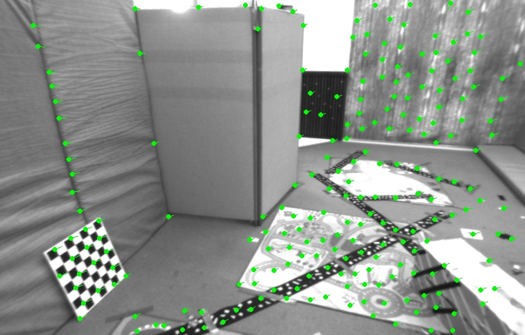

# Visual Odometry Using Direct Methods

---

## Lukas-Kanade Optical Flow

### 1. Research Review

#### a. How many categories could Lukas-Kanade algorithm be classified into?

**Four** categories. They are forward additive, forward compositional, inverse additive and inverse compositional.

#### b. Why warp of original image is needed for compositional methods? What is its physical meaning?

#### c. What are the differences between forward and inverse methods?

### 2. Forward Additive through Gauss-Newton

### 3. Inverse Additive through Gauss-Newton

### 4. Coarse-to-Fine Pyramid

