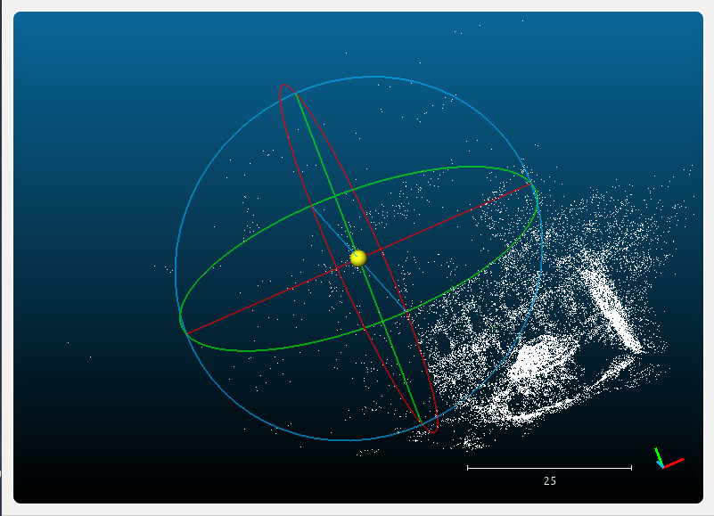
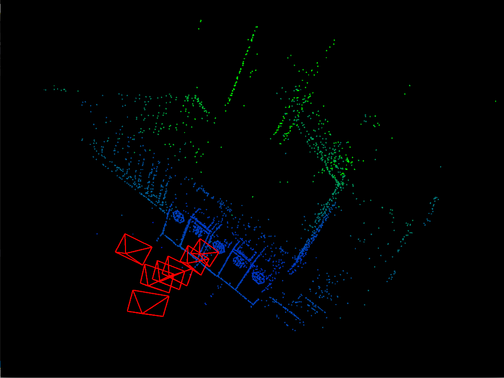

# Backend Optimization

---

## Bundle Adjustment Research Review

### 1. Why bundle adjustment is NOT slow

The optimization problem of bundle adjustment has special sparse structure, which can be used for efficient even real-time solution of the problem.

### 2. How to parameterize bundle adjustment problem? What are the respective methods for pose and point?

### 3. How does this paper indicates the future research trends?

## Bundle Adjustment for Feature Points

In this problem the <a href="http://grail.cs.washington.edu/projects/bal/">BAL dataset</a> is used and a g2o based BA solver is implemented.

The optimized poses and points for Dubrovnik is as follows:



### Analytical Jacobian derivation:

The <a href="workspace/01-BAL-g2o/jacobian-derivation/Jacobian-Derivation-for-BAL.ipynb">Jupyter notebook</a> can be used to derive the analytical Jacobian for poses and points. It uses SymPy to generate the required C++ code automatically.

Below is the _linearizeOplus_ method implemention for observation edge:
```c++
    virtual void linearizeOplus() override
    {   
        //
        // 1. use analytical Jacobian
        // this implementation mimics that of g2o::sba::VertexSE3ExpMap
        // the required Jacobians can be derived automatically using the accompany Jupyter notebook
        // using SymPy
        //
        const VertexCameraBAL *vertex_camera = static_cast<const VertexCameraBAL*>(vertex(0));
        const VertexPointBAL *vertex_point = static_cast<const VertexPointBAL*>(vertex(1));

        // camera pose:
        const g2o::SE3Quat &T = vertex_camera->estimate().T;
        // intrinsic:
        double f = vertex_camera->estimate().f;
        // radial distortion:
        double k1 = vertex_camera->estimate().k1;
        double k2 = vertex_camera->estimate().k2;
        // point in world frame:
        const Eigen::Vector3d &p_world = vertex_point->estimate();
        // point in camera frame:
        Eigen::Vector3d p_camera = T.map(p_world);
        double x = p_camera.x();
        double x_2 = x*x;
        double y = p_camera.y();
        double y_2 = y*y;
        double z = p_camera.z();
        double z_2 = z*z; double z_3 = z*z_2; double z_4 = z_2*z_2; double z_5 = z*z_4; double z_6 = z_3*z_3;
        double r_2 = (x_2 + y_2);
        double r_4 = r_2*r_2;

        // Jacobian for camera:
        _jacobianOplusXi(0,0) = -f*x*y*(z_4 + 2*z_2*(k1*z_2 + 2*k2*r_2) + r_2*(k1*z_2 + k2*r_2) + 2*r_2*(k1*z_2 + 2*k2*r_2))/z_6;
        _jacobianOplusXi(0,1) = f*(x_2*(z_4 + r_2*(k1*z_2 + k2*r_2) + 2*r_2*(k1*z_2 + 2*k2*r_2)) + z_2*(2*x_2*(k1*z_2 + 2*k2*r_2) + z_4 + r_2*(k1*z_2 + k2*r_2)))/z_6;
        _jacobianOplusXi(0,2) = -f*y*(z_4 + r_2*(k1*z_2 + k2*r_2))/z_5;
        _jacobianOplusXi(0,3) = f*(2*x_2*(k1*z_2 + 2*k2*r_2) + z_4 + r_2*(k1*z_2 + k2*r_2))/z_5;
        _jacobianOplusXi(0,4) = 2*f*x*y*(k1*z_2 + 2*k2*r_2)/z_5;
        _jacobianOplusXi(0,5) = -f*x*(z_4 + r_2*(k1*z_2 + k2*r_2) + 2*r_2*(k1*z_2 + 2*k2*r_2))/z_6;
        _jacobianOplusXi(0,6) = x*(z_4 + r_2*(k1*z_2 + k2*r_2))/z_5;
        _jacobianOplusXi(0,7) = f*x*r_2/z_3;
        _jacobianOplusXi(0,8) = f*x*r_4/z_5;

        _jacobianOplusXi(1,0) = -f*(y_2*(z_4 + r_2*(k1*z_2 + k2*r_2) + 2*r_2*(k1*z_2 + 2*k2*r_2)) + z_2*(2*y_2*(k1*z_2 + 2*k2*r_2) + z_4 + r_2*(k1*z_2 + k2*r_2)))/z_6;
        _jacobianOplusXi(1,1) = f*x*y*(z_4 + 2*z_2*(k1*z_2 + 2*k2*r_2) + r_2*(k1*z_2 + k2*r_2) + 2*r_2*(k1*z_2 + 2*k2*r_2))/z_6;
        _jacobianOplusXi(1,2) = f*x*(z_4 + r_2*(k1*z_2 + k2*r_2))/z_5;
        _jacobianOplusXi(1,3) = 2*f*x*y*(k1*z_2 + 2*k2*r_2)/z_5;
        _jacobianOplusXi(1,4) = f*(2*y_2*(k1*z_2 + 2*k2*r_2) + z_4 + r_2*(k1*z_2 + k2*r_2))/z_5;
        _jacobianOplusXi(1,5) = -f*y*(z_4 + r_2*(k1*z_2 + k2*r_2) + 2*r_2*(k1*z_2 + 2*k2*r_2))/z_6;
        _jacobianOplusXi(1,6) = y*(z_4 + r_2*(k1*z_2 + k2*r_2))/z_5;
        _jacobianOplusXi(1,7) = f*y*r_2/z_3;
        _jacobianOplusXi(1,8) = f*y*r_4/z_5;

        // Jacobian for point:
        Eigen::Matrix<double,2,3> P;
        P(0,0) = f*(2*x_2*(k1*z_2 + 2*k2*r_2) + z_4 + r_2*(k1*z_2 + k2*r_2))/z_5;
        P(0,1) = 2*f*x*y*(k1*z_2 + 2*k2*r_2)/z_5;
        P(0,2) = -f*x*(z_4 + r_2*(k1*z_2 + k2*r_2) + 2*r_2*(k1*z_2 + 2*k2*r_2))/z_6;

        P(1,0) = 2*f*x*y*(k1*z_2 + 2*k2*r_2)/z_5;
        P(1,1) = f*(2*y_2*(k1*z_2 + 2*k2*r_2) + z_4 + r_2*(k1*z_2 + k2*r_2))/z_5;
        P(1,2) = -f*y*(z_4 + r_2*(k1*z_2 + k2*r_2) + 2*r_2*(k1*z_2 + 2*k2*r_2))/z_6;
  
        _jacobianOplusXj = P * T.rotation().toRotationMatrix();
    }
```

## Bundle Adjustment for Direct Method

In this problem a g2o based BA solver is implemented for direct method.

The optimized poses and points for Dubrovnik is as follows:



### Analytical Jacobian derivation:

The <a href="workspace/02-direct-g2o/jacobian-derivation/Jacobian-Derivation-for-BAL.ipynb">Jupyter notebook</a> can be used to derive the analytical Jacobian for poses and points. It uses SymPy to generate the required C++ code automatically.

Below is the _linearizeOplus_ method implemention for observation edge:
```c++
    virtual void linearizeOplus() override
    {   
        //
        // 1. use analytical Jacobian
        // this implementation mimics that of g2o::sba::VertexSE3ExpMap
        // the required Jacobians can be derived automatically using the accompany Jupyter notebook
        // using SymPy
        //
        const VertexSophus* vertex_camera = static_cast<const VertexSophus*>(vertex(0));
        const g2o::VertexSBAPointXYZ* vertex_point = static_cast<const g2o::VertexSBAPointXYZ*>(vertex(1));  

        // project to camera frame:
        const Eigen::Vector3d point_camera = (vertex_camera->estimate())*(vertex_point->estimate());
        double x = point_camera.x();
        double x_2 = x*x;
        double y = point_camera.y();
        double y_2 = y*y;
        double z = point_camera.z();
        double z_2 = z*z;

        // project to pixel frame:
        camera_point_projection(
            vertex_camera->estimate(), vertex_point->estimate(),
            projections
        );

        // Jacobian of se3:
        Eigen::Matrix<double, 2, 6> J_se3;
        J_se3(0,0) = fx*x*y/z_2;
        J_se3(0,1) = -fx*x_2/z_2 - fx;
        J_se3(0,2) = fx*y/z;
        J_se3(0,3) = -fx/z;
        J_se3(0,4) = 0;
        J_se3(0,5) = fx*x/z_2;

        J_se3(1,0) = fy*y_2/z_2 + fy;
        J_se3(1,1) = -fy*x*y/z_2;
        J_se3(1,2) = -fy*x/z;
        J_se3(1,3) = 0;
        J_se3(1,4) = -fy/z;
        J_se3(1,5) = fy*y/z_2;

        // Jacobian of point:
        Eigen::Matrix<double, 2, 3> J_P;
        J_P(0,0) = -fx/z;
        J_P(0,1) = 0;
        J_P(0,2) = fx*x/z_2;

        J_P(1,0) = 0;
        J_P(1,1) = -fy/z;
        J_P(1,2) = fy*y/z_2;
        J_P = J_P*(vertex_camera->estimate().rotation_matrix());

        // image gradient:
        Eigen::Matrix<double, 16, 2> J_i;
        double u = projections[0]; double v = projections[1];
        for (int i = 0; i < FULL_PATCH_SIZE; ++i) {
            for (int j = 0; j < FULL_PATCH_SIZE; ++j) {
                const int idx = FULL_PATCH_SIZE*i + j;
                const Eigen::Vector2d J_i_ = image.get_gradient(
                    u + DELTA[i], v + DELTA[j]
                );
                J_i(idx, 0) = J_i_(0);
                J_i(idx, 1) = J_i_(1);
            }
        }

        _jacobianOplusXi = J_i*J_se3;
        _jacobianOplusXj = J_i*J_P;   
    }
```
